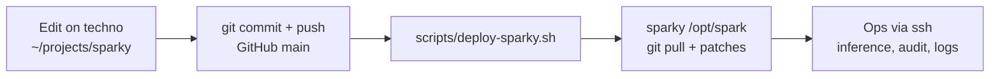

# AGENT.md — Sparky homelab (`/opt/spark`)

Quick orientation for humans and coding agents working on this repo.

## What this is

Private dashboard + ops tooling for a **DGX Spark** (`sparky`, `192.168.0.101`): portal UI, model inventory, NAS shelf sync, inference smoke stacks.

## Layout

```
/opt/spark/
├── AGENT.md              This file
├── README.md             Repo homepage (GitHub + local)
├── portal/               Static UI (nginx :80)
│   ├── assets/           sparky-theme.js, oobe-nebula.js, nebula-tune.js
│   └── themes/           theme-b.css, theme-ui.css
├── scripts/              spark CLI + implementation scripts
├── install/              Idempotent sudo install scripts (see install/INSTALL.md)
├── data/                 model-catalog.yaml, model-verification.yaml, inference-profiles.yaml, ds4-dwarfstar.yaml
├── recipes/              Inference profile recipes (Phase 5)
├── docs/                 ROADMAP + guides/ runbooks/ reference/ examples/
└── services/             compose/yaml for inference UIs
```

**Staging:** edit on **techno** (`~/projects/sparky`), push to GitHub, deploy with `scripts/deploy-sparky.sh`. Runtime install is **`sparky:/opt/spark`** only.

**Generated (gitignored):** `portal/models.json`, `logs/`, `run/`, `venv/`

## Development workflow (techno → GitHub → sparky)



| Layer | Path | Role |
|-------|------|------|
| Dev clone | `~/projects/sparky` on techno | Cursor agent, commit, push |
| Remote | `github.com/shawnmarck/sparky-dashboard` | Source of truth |
| Install | `/opt/spark` on sparky | Pull only — what nginx, `spark`, venv use |

**Rules for agents**

1. **Code** (scripts, recipes, portal, docs): change on techno → commit → `./scripts/deploy-sparky.sh`. Do not `scp` to `/opt/spark` except emergencies (then commit immediately).
2. **Ops** (inference up/down, golden audit, log tails): `ssh sparky '…'` — expected from techno sessions.
3. **Runtime data** (`data/model-verification.yaml`, benchmarks): updated on sparky by `spark models verify`, bench, inventory — deploy stashes **code paths only**, not all of `data/`.
4. After deploy, check drift: `./scripts/deploy-sparky.sh --status`.

```bash
# From ~/projects/sparky on techno
./scripts/deploy-sparky.sh                    # push + pull + apply patches
SKIP_PUSH=1 ./scripts/deploy-sparky.sh        # pull only (already pushed)
REGENERATE_INVENTORY=1 ./scripts/deploy-sparky.sh
./scripts/deploy-sparky.sh --status
```

Emergency stash on sparky from a deploy: `ssh sparky 'cd /opt/spark && git stash list'`.


## Canonical docs (read these)

| Doc | Use when |
|-----|----------|
| `docs/ROADMAP.md` | **The plan** — phases, status, next steps |
| `README.md` | Repo homepage + doc index |
| `docs/guides/model-shelf.md` | `/models` + NAS shelf layout |
| `docs/guides/model-picks.md` | Why each model is in the catalog |
| `docs/runbooks/smoke-vllm-eugr.md` | eugr vLLM validation (`spark engine eugr`) |
| `docs/runbooks/smoke-llamacpp.md` | llama.cpp validation (`spark engine llama`) |
| `docs/runbooks/smoke-ds4.md` | DwarfStar ds4 validation (`spark engine ds4`) |
| `docs/runbooks/new-model-golden-benchmark.md` | Onboard new models: golden map, audit, ctx viability |
| `docs/guides/local-model-testing.md` | Bench queue SOP, golden audit, stack fixes learned |
| `docs/reference/inference-stack.md` | Phase 5 technical spec |
| `install/INSTALL.md` | Install script index + order |

`docs/ROADMAP.md` is the single source of truth for phases. Other docs are guides, runbooks, or specs — see `README.md`.

## Key URLs

| Service | URL |
|---------|-----|
| Portal | http://sparky/ |
| Models | http://sparky/models.html |
| Metrics API | http://sparky/api/gpu |
| Inference API | http://sparky/api/inference/status (nginx → :8767) |
| **Inference gateway** | http://sparky:9000/v1 (OpenAI-compatible; aliases + auto-switch) |
| Shelf API | http://sparky/api/shelf/status |
| vLLM | http://sparky:8000/v1 |
| llama.cpp | http://sparky:8081/v1 |
| Open WebUI | http://sparky:3000 |
| Hermes UI | http://sparky:9119 |
| Netdata | http://sparky:19999/v3/ |

## Portal theme (optional)

**Theme B** — DGX OOBE-style canvas nebula behind System and Models. Opt-in via the constellation button in the nav (persists in `localStorage` key `sparky-theme`, or `?theme=b` on first load). Default theme unchanged.

- JS: `portal/assets/sparky-theme.js` (toggle, iframe sync), `portal/assets/oobe-nebula.js` (canvas)
- CSS: `portal/themes/theme-b.css`, `portal/themes/theme-ui.css`
- Dev tuning panel: gear icon (bottom-left) when Theme B is on; hide with `?nebula-tune=0`
- Models in portal iframe: parent nav toggle syncs theme via `postMessage`; no duplicate floating toggle when embedded

## Rules agents should know

1. **One GPU engine at a time** — `spark engine eugr down` before `spark engine llama up` (and vice versa).
2. **Do not re-run `install/05` blindly** — it writes nginx via `common.sh` (safe now), but always prefer `install/common.sh` helper.
3. **Shelf APIs are unauthenticated on LAN** — OK for trusted home LAN only; don't expose port 80 WAN-side.
4. **Inventory build needs venv** — `/opt/spark/venv/bin/python scripts/spark-inventory-build.py` (HF API).
5. **Model paths** — local `/models`, NAS `/mnt/model-shelf/models`.
6. **Bake-off UIs removed** — no Rookery / vLLM Studio; Phase 5 is `spark inference` + `recipes/`.
7. **Recipes are auto-scaffolded** — after download, `spark-hf` queue worker calls `scaffold_recipe` / specialized scaffolds in `spark-inference.py`. Do not hand-write recipe YAML unless scaffold cannot route the architecture (MoE, multimodal, DFlash, ds4, MTP). Extend the scaffold router in code + catalog `engine`/`capabilities` when adding new engine types. Failed scaffolds surface as `scaffold_error` on queue items — fix routing, don't bypass with manual YAML.

## `spark` CLI (humans + agents)

**Canonical reference:** `docs/reference/spark-cli.md`

Single command on PATH: **`spark`** (`install/20-spark-cli.sh`). Legacy `spark-*` bins removed — see `scripts/legacy/README.md`.

| Who | How to discover | How to run |
|-----|-----------------|------------|
| **Human** (zsh on sparky) | `spark ?`, `spark inf help`, Tab completion | Interactive shell |
| **Coding agent** | `spark --help`, `spark inference help`, `spark inference list` | Non-interactive; prefer `help` over `?` |
| **No shell** | HTTP APIs | `http://sparky/api/inference/status`, `/api/gpu`, `/api/shelf/status` |

```bash
spark status
spark inference list       # enabled profiles — agents: run before spark inference up
spark inference status     # active profile + engine health
spark inference up <id>    # switch profile (evicts current)
spark inference bench      # measure tok/s on active profile
spark recipe list          # Model Lab recipes (draft/testing/production)
spark models inventory     # regenerate portal/models.json
spark models verify set <lab/slug> works
spark shelf pull <lab/slug>
spark engine eugr status   # low-level vLLM (direct)
spark engine llama status  # low-level llama.cpp (direct)
spark gpu                  # metrics JSON (same schema as /api/gpu)
curl http://sparky/api/inference/status   # JSON for portal/gateway
```

**Agents:** use `/usr/local/bin/spark` if `PATH` is minimal; check exit codes; one GPU engine at a time. Do not rely on Tab or unquoted `?`.

## Install (typical order)

See `install/INSTALL.md` for full index. Core path:

```bash
sudo bash install/02-model-shelf-mount.sh
sudo bash install/03-model-shelf-layout.sh
sudo bash install/04-model-inventory.sh
sudo bash install/05-model-inventory-auto-refresh.sh
sudo bash install/10-portal-gpu-widget.sh
sudo bash install/11-model-shelf-api.sh
```

Inference (pick what you need): `16-eugr-vllm-qwen36.sh`, `13-llama-cpp-smoke.sh`.

## Sudo

Passwordless sudo for `install/*.sh` only (via `00-grant-install-sudo.sh`). Optional full agent sudo: `install/07-grant-agent-sudo.sh`.

## Inference API reload (agents)

`scripts/spark-inference-api.py` is a thin HTTP shell on **:8767** (proxied as `http://sparky/api/inference/*`). It delegates every GET/POST/PATCH to `scripts/spark-inference.py:api_dispatch()` and **reloads the core module on each request** — bench, switch, recipe lifecycle, and history routes all live in `spark-inference.py`.

- **Routine changes to `spark-inference.py`:** no restart; hit any `/api/inference/*` endpoint after saving.
- **Changes to `spark-inference-api.py` itself:** restart the service — `sudo bash install/19-inference-api-restart.sh` (or `sudo systemctl restart spark-inference-api`).
- **Auto-restart on script save:** `sudo bash install/18-inference-api-watch.sh` (systemd path unit; chained from `17`).

## Golden audit & new models

**Policy:** `spark models verify set … works` only after **bench v2** succeeds (`docs/reference/benchmark-standard.md`).

```bash
# Full fleet
nohup /opt/spark/venv/bin/python3 scripts/golden-inventory-audit.py \
  --reset-verify --skip-shelf >> logs/golden-audit.log 2>&1 &

# New models only
scripts/spark-new-model-golden.sh qwen/qwen-agentworld-35b-a3b empero-ai/qwythos-9b-claude-mythos-5-1m
```

Reports: `run/golden-audit-report.json` + `.md`. Golden map: `data/golden-recipes.yaml`.

**Common eugr fixes (Qwen agents / Grok):**

- Text-only MM checkpoint: `--language-model-only` when `config.json` has `"language_model_only": true` (AgentWorld).
- Grok `tool_choice: auto`: `--enable-auto-tool-choice` + `--tool-call-parser qwen3_xml` on eugr YAML.

**Context viability (load + smoke, no bench):** `scripts/ctx-viability-test.sh`, `scripts/update-recipe-ctx.py` — see runbook.

## Hermes spark-bot

Compose + deploy live under `hermes/` in this repo; runtime on host is **`/opt/hermes`** (outside `/opt/spark`). Do **not** stop Model Lab inference for routine bot work. See `hermes/spark-bot/AGENTS.md`, deploy via `hermes/scripts/deploy-spark-bot.sh`.

## Threat model (short)

- LAN-trusted homelab; mutation APIs on :80 have no auth.
- Secrets: `/etc/spark/smb-credentials-models`, `HF_TOKEN` in env — never commit.