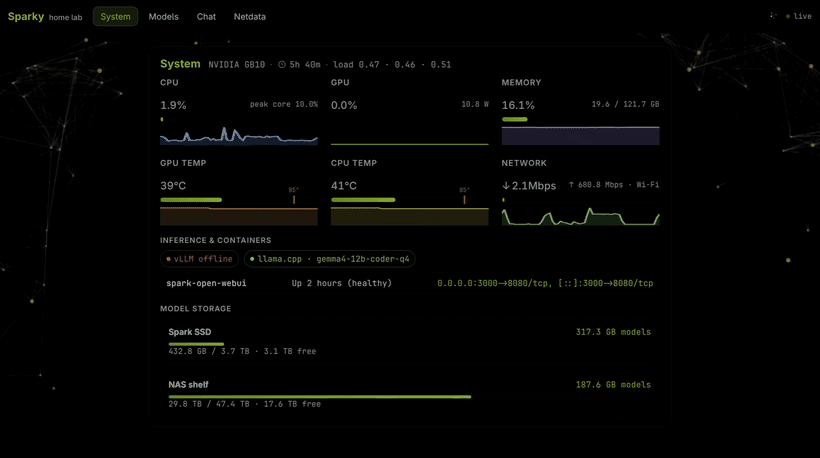

# Spark Home Lab

Private ops dashboard for **DGX Spark** (`sparky`) — portal, model inventory, NAS shelf sync, inference tooling.

  

## Links

| | |
|---|---|
| [docs/ROADMAP.md](docs/ROADMAP.md) | Phases, status, what's next |
| [AGENT.md](AGENT.md) | Repo layout, rules, commands |
| [install/INSTALL.md](install/INSTALL.md) | Install script index |

## Docs

| Path | Topic |
|------|-------|
| [docs/guides/model-shelf.md](docs/guides/model-shelf.md) | `/models` + NAS shelf layout |
| [docs/guides/model-picks.md](docs/guides/model-picks.md) | Why each model is in the catalog |
| [docs/runbooks/smoke-vllm-eugr.md](docs/runbooks/smoke-vllm-eugr.md) | eugr vLLM smoke test |
| [docs/runbooks/smoke-llamacpp.md](docs/runbooks/smoke-llamacpp.md) | llama.cpp smoke test |
| [docs/reference/inference-stack.md](docs/reference/inference-stack.md) | Phase 5 inference control plane |
| [docs/examples/](docs/examples/) | YAML templates |