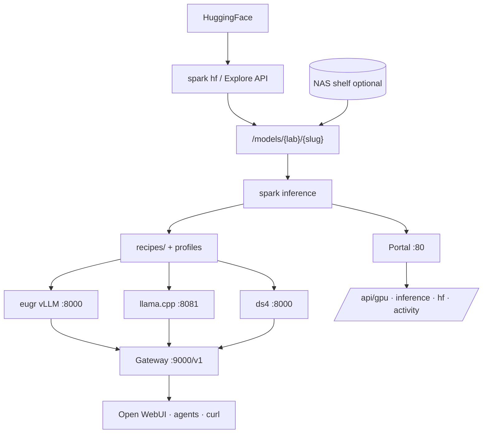

<div align="center">

# SparkBench

**Open-source model lab for the NVIDIA DGX Spark (GB10).**

Discover models · Benchmark them · Switch profiles · Serve them.
One CLI, one box, no cloud.

[Live leaderboard](https://sparkbench.dev) · [Docs](#documentation) · [Contributing](CONTRIBUTING.md)

[](LICENSE)
[](CONTRIBUTING.md)

</div>

<p align="center">
  
</p>

<p align="center"><sub>Portal — switch profiles, browse models, explore HuggingFace. <a href="docs/assets/RECORDING.md">Record CLI / install demos</a></sub></p>

---

## What it is

SparkBench is a self-hosted dashboard and inference control plane for a single DGX Spark. It bundles everything you need to evaluate models on GB10 hardware without leaving a single CLI:

- **Portal**: System metrics, model browser, inference panel, HuggingFace explorer
- **Three engines**: vLLM (eugr), llama.cpp, ds4 (DeepSeek V4 Flash). One CLI to switch.
- **Model Lab**: Auto-scaffold recipes from weights, mark testing, bench, promote to production
- **Versioned benchmarks**: Reproducible tok/s, multi-turn agent loops, context ladder
- **HuggingFace integration**: Search, queue, download, dedupe; weights land in a canonical tree
- **NAS shelf sync** (optional): Mirror models to/from a CIFS share when you have one; works fine with local `/models` only

The benchmarks generated here populate **[sparkbench.dev](https://sparkbench.dev)** — the public GB10 leaderboard.

## Why

DGX Spark is excellent hardware but ships without an opinionated way to run models on it. SparkBench is that opinion: a closed loop from *I saw a new model on HuggingFace* to *it's promoted, benched, and serving on my box at this many tok/s*.

If you own a Spark, run this. If you're considering one, check the [leaderboard](https://sparkbench.dev) to see what it can actually do.

## Why not just vLLM or llama.cpp?

Raw engines are great. SparkBench wraps them for **one GB10 box, one loop**:

| You want… | Raw vLLM / llama.cpp | SparkBench |
|-----------|----------------------|------------|
| Run one model | Write compose YAML, pick ports, remember flags | `spark inference up <profile>` |
| Switch models | Stop container, edit config, restart (minutes) | Same CLI — recipes hold engine-specific flags |
| Compare tok/s fairly | Roll your own scripts | `spark inference bench` (bench v2: long ctx + tools + agent turns) |
| Try a new HF model | Download + hand-write serve config | Explore queue → auto-scaffold recipe → bench → promote |
| Share results | Paste numbers in a gist | Verification YAML → [sparkbench.dev](https://sparkbench.dev) leaderboard |
| Agent / UI access | Wire OpenAI URL yourself | Gateway `:9000/v1` + portal + HTTP APIs |

SparkBench **uses** eugr vLLM, llama.cpp, and ds4 — it does not replace them. It adds the control plane, inventory, and reproducible benchmark layer on top.

## Quickstart

### For LLM Agents

Fetch the full guide and follow it step by step:

```bash
curl -fsSL https://raw.githubusercontent.com/shawnmarck/sparkbench/v0.1.0/docs/guides/installation-instructions.md
```

### For Humans

**One command** — clone to `/opt/spark`, bootstrap host env, portal, APIs, and CLI (no GPU engine yet):

```bash
curl -fsSL https://raw.githubusercontent.com/shawnmarck/sparkbench/main/scripts/bootstrap-sparkbench.sh | sudo bash
```

Then pick an engine and the gateway:

```bash
sudo bash install/spark-install engine eugr   # or llama | ds4
sudo bash install/spark-install gateway
bash scripts/sparky-protect-runtime.sh
spark models inventory
```

<details>
<summary>Manual install (same steps, no curl bootstrap)</summary>

```bash
git clone https://github.com/shawnmarck/sparkbench.git /opt/spark
cd /opt/spark
export SPARK_HOST=mybox SPARK_LAN_IP=192.168.1.50 SPARK_USER="$USER"
sudo bash install/spark-install quickstart    # bootstrap + core
sudo bash install/spark-install engine eugr
sudo bash install/spark-install gateway
```

</details>

Open **http://&lt;host&gt;/** · Full module index: [install/INSTALL.md](install/INSTALL.md)

### CLI in action

Example session after `engine` + `gateway` are up (record a GIF: [docs/assets/RECORDING.md](docs/assets/RECORDING.md)):

```text
$ spark inference list
  qwen36-nvfp4          eugr     heavy   enabled
  qwen36-q4-llama       llamacpp heavy   enabled

$ spark inference up qwen36-nvfp4
  switching… (evicts current engine; may take minutes on NVFP4)

$ spark inference status
  profile: qwen36-nvfp4   engine: eugr   ready: true

$ spark inference bench
  bench v2 … decode 142.3 tok/s   ctx 32768   written to run/

$ curl -s http://sparky:9000/v1/models | head
  … aliases + active profile …
```

**Before:** docker compose edits, manual restarts, ad-hoc timing. **After:** four commands from discover → serve → measure → gateway.

## Use it

One CLI on PATH: `spark`. Designed for humans and coding agents alike.

```bash
spark status                          # everything in one glance
spark inference list                  # available profiles
spark inference up qwen36-q4-llama    # switch profile (evicts current)
spark inference bench                 # measure tok/s on the active profile
spark inference logs                  # tail engine logs

spark recipe list                     # draft / testing / production recipes
spark models inventory                # rebuild portal data
spark models verify set <lab/slug> works

spark hf search "deepseek v3"         # explore HuggingFace
spark hf queue add <repo>             # background download
spark shelf push <lab/slug>           # mirror to NAS (when shelf is mounted)
```

Full reference: [docs/reference/spark-cli.md](docs/reference/spark-cli.md).

Or hit the HTTP API directly:

```bash
curl http://sparky/api/inference/status
curl http://sparky/api/gpu
curl http://sparky/api/shelf/status
```

OpenAI-compatible gateway on `:9000` for hooking up Open WebUI, Hermes, Grok, etc.

## The Model Lab loop

The product is a closed loop. Every new model goes through the same stages, each one scannable in the portal:

```
  Explore  ─▶  Download  ─▶  Draft recipe  ─▶  Test  ─▶  Bench  ─▶  Promote
 (HF browse)  (queue)      (auto-scaffold)              (tok/s)    (production)
```

| Step      | Portal tab        | Backend                                  |
| --------- | ----------------- | ---------------------------------------- |
| Discover  | Explore           | `/api/hf/*`, explore queue               |
| Acquire   | Download queue    | `spark hf`, `/models/{lab}/`             |
| Define    | Models → scaffold | `scaffold_auto`, `recipes/drafts/`       |
| Validate  | Inference         | `spark inference`, async bench           |
| Promote   | Models → promote  | `recipes/` + `inference-profiles.yaml`   |
| Operate   | System            | Gateway `:9000`, client activity widget  |

Recipes are auto-scaffolded from weights + HuggingFace metadata. Hand-written YAML is reserved for engine quirks the router can't pick (MoE, multimodal, DFlash, ds4, MTP).

## Engines

| Engine     | What it serves           | When to use                                   |
| ---------- | ------------------------ | --------------------------------------------- |
| **eugr**   | vLLM (NVFP4, FP8)        | High-throughput dense + MoE, long context     |
| **llama.cpp** | GGUF (Q4, Q5, MTP)     | Lower memory, broad model support, fast switch |
| **ds4**    | DeepSeek V4 Flash (native) | Specialized sparse attention path             |

One GPU at a time. `spark inference up <profile>` evicts the current engine and loads the next one. Production recipes are pinned in [`data/golden-recipes.yaml`](data/golden-recipes.yaml).

## Architecture



One GPU engine at a time. Static portal on nginx :80. Mutation APIs are LAN-trusted — don't expose port 80 to the WAN.

<details>
<summary>ASCII version</summary>

```
HuggingFace → spark hf → /models/ ← NAS (optional)
                ↓
         spark inference (recipes)
                ↓
    eugr :8000 · llama :8081 · ds4 :8000
                ↓
         Gateway :9000/v1 → agents / Open WebUI
```

</details>

## Documentation

| Path | Topic |
|------|--------|
| [CHANGELOG.md](CHANGELOG.md) | Release history |
| [AGENTS.md](AGENTS.md)                                                                | Agent manual: layout, rules, code touchpoints    |
| [docs/guides/installation-instructions.md](docs/guides/installation-instructions.md)  | Full install + ops guide (LLM agents fetch via README) |
| [docs/reference/spark-cli.md](docs/reference/spark-cli.md)                            | Full `spark` CLI reference                       |
| [docs/reference/inference-stack.md](docs/reference/inference-stack.md)                | Inference control plane spec                     |
| [docs/reference/benchmark-standard.md](docs/reference/benchmark-standard.md)          | Bench v2: long-ctx + tool-use methodology          |
| [docs/guides/first-spark-setup.md](docs/guides/first-spark-setup.md)                  | First Spark setup: clone → recipes → fetch         |
| [docs/guides/model-shelf.md](docs/guides/model-shelf.md)                              | `/models` + NAS shelf layout                     |
| [docs/guides/model-picks.md](docs/guides/model-picks.md)                              | Why each model is in the catalog                 |
| [docs/guides/local-model-testing.md](docs/guides/local-model-testing.md)              | Bench queue + stack fixes SOP                    |
| [docs/runbooks/smoke-vllm-eugr.md](docs/runbooks/smoke-vllm-eugr.md)                  | vLLM smoke test                                  |
| [docs/runbooks/smoke-llamacpp.md](docs/runbooks/smoke-llamacpp.md)                    | llama.cpp smoke test                             |
| [docs/runbooks/smoke-ds4.md](docs/runbooks/smoke-ds4.md)                              | ds4 smoke test                                   |
| [docs/runbooks/new-model-golden-benchmark.md](docs/runbooks/new-model-golden-benchmark.md) | Golden audit for a new model                 |
| [install/INSTALL.md](install/INSTALL.md) | Install targets + modules |
| [docs/assets/RECORDING.md](docs/assets/RECORDING.md) | How to capture CLI / install demos |

## Contributing

PRs welcome. See [CONTRIBUTING.md](CONTRIBUTING.md): one PR per task, deploy smoke after merge.

Two great ways to help:

1. **Bench a new model** on your Spark and open a PR with the recipe + verification YAML. It shows up on [sparkbench.dev](https://sparkbench.dev) automatically.
2. **Fix a sharp edge**: runbooks, install scripts, portal UX. Small, focused PRs preferred.

## License

[MIT](LICENSE). Not affiliated with or endorsed by NVIDIA Corporation.
