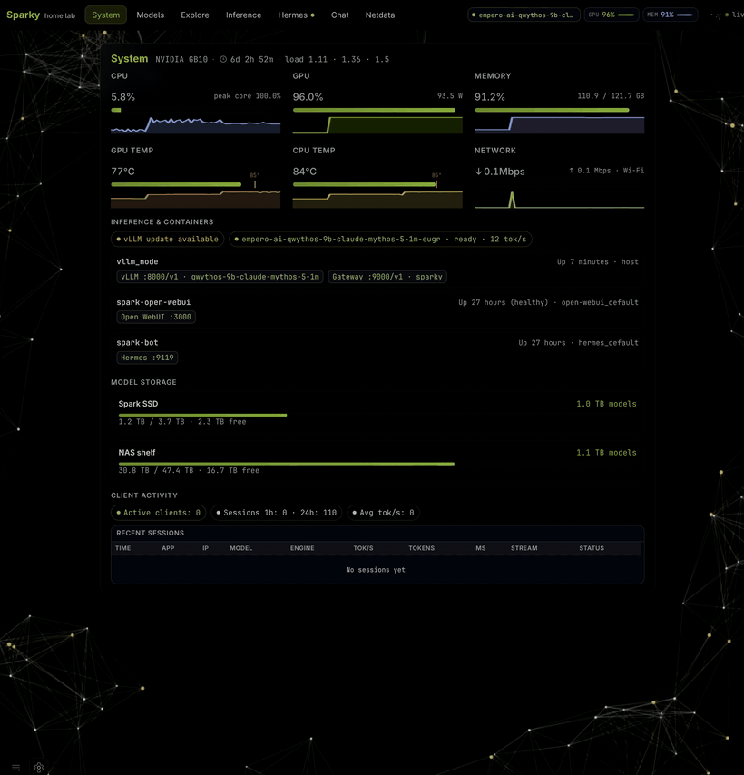

<div align="center">

# SparkBench

**Open-source model lab for the NVIDIA DGX Spark (GB10).**

Discover models · Benchmark them · Switch profiles · Serve them.
One CLI, one box, no cloud.

[Live leaderboard](https://sparkbench.dev) · [Docs](#documentation) · [Contributing](CONTRIBUTING.md)

[](LICENSE)
[](CONTRIBUTING.md)

</div>

<p align="center">
  
</p>

---

## What it is

SparkBench is a self-hosted dashboard and inference control plane for a single DGX Spark. It bundles everything you need to evaluate models on GB10 hardware without leaving a single CLI:

- **Portal**: System metrics, model browser, inference panel, HuggingFace explorer
- **Three engines**: vLLM (eugr), llama.cpp, ds4 (DeepSeek V4 Flash). One CLI to switch.
- **Model Lab**: Auto-scaffold recipes from weights, mark testing, bench, promote to production
- **Versioned benchmarks**: Reproducible tok/s, multi-turn agent loops, context ladder
- **HuggingFace integration**: Search, queue, download, dedupe; weights land in a canonical tree
- **NAS shelf sync** (optional): Mirror models to/from a CIFS share when you have one; works fine with local `/models` only

The benchmarks generated here are what populate **[sparkbench.dev](https://sparkbench.dev)**, the public GB10 leaderboard.

## Why

DGX Spark is excellent hardware but ships without an opinionated way to run models on it. SparkBench is that opinion: a closed loop from *I saw a new model on HuggingFace* to *it's promoted, benched, and serving on my box at this many tok/s*.

If you own a Spark, run this. If you're considering one, check the [leaderboard](https://sparkbench.dev) to see what it can actually do.

## Quickstart

```bash
git clone https://github.com/shawnmarck/sparkbench.git /opt/spark
cd /opt/spark

# (optional) match your host and runtime user
export SPARK_HOST=mybox
export SPARK_LAN_IP=192.168.1.50
export SPARK_USER="$USER"

# Core install (idempotent, safe to re-run)
sudo bash install/spark-install bootstrap    # optional: passwordless install re-runs
sudo bash install/spark-install core         # portal, APIs, CLI, model inventory
sudo bash install/spark-install engine eugr  # or: engine llama | engine ds4
sudo bash install/spark-install gateway      # :9000/v1 OpenAI proxy + activity widget

# Optional NAS shelf mirror (skip if you have no CIFS share)
# sudo bash install/spark-install nas
```

After `core`, `spark install …` works too (same orchestrator). Full module index: [install/INSTALL.md](install/INSTALL.md).

## For coding agents

SparkBench exposes **three surfaces** on one box:

| Surface | Use when |
|---------|----------|
| **CLI** — `spark` | Shell or SSH on the Spark host (preferred) |
| **HTTP API** — `/api/inference/*`, `/api/hf/*`, `/api/gpu` | Your harness has `curl` but no shell |
| **Portal UI** — `http://<host>/` | Visual state, Explore, Model Lab |

Install the **agent skill** once so Claude Code, Cursor, Codex, or similar can install and operate the box without reading the whole repo. In Claude Code, invoke `/sparkbench` or let it auto-load from the description.

**One-liner** (global skill — copy the block):

```bash
mkdir -p ~/.claude/skills/sparkbench && curl -fsSL -o ~/.claude/skills/sparkbench/SKILL.md https://raw.githubusercontent.com/shawnmarck/sparkbench/main/.claude/skills/sparkbench/SKILL.md && mkdir -p ~/.claude/skills/sparkbench/references && curl -fsSL -o ~/.claude/skills/sparkbench/references/api.md https://raw.githubusercontent.com/shawnmarck/sparkbench/main/.claude/skills/sparkbench/references/api.md
```

Cursor: use `~/.cursor/skills/sparkbench` instead of `~/.claude/skills/sparkbench`. **Or clone this repo** — project skills ship at [`.claude/skills/sparkbench/`](.claude/skills/sparkbench/SKILL.md) and [`.cursor/skills/sparkbench/`](.cursor/skills/sparkbench/SKILL.md).

Raw skill: `https://raw.githubusercontent.com/shawnmarck/sparkbench/main/.claude/skills/sparkbench/SKILL.md`

## Use it

One CLI on PATH: `spark`. Designed for humans and coding agents alike.

```bash
spark status                          # everything in one glance
spark inference list                  # available profiles
spark inference up qwen36-q4-llama    # switch profile (evicts current)
spark inference bench                 # measure tok/s on the active profile
spark inference logs                  # tail engine logs

spark recipe list                     # draft / testing / production recipes
spark models inventory                # rebuild portal data
spark models verify set <lab/slug> works

spark hf search "deepseek v3"         # explore HuggingFace
spark hf queue add <repo>             # background download
spark shelf push <lab/slug>           # mirror to NAS (when shelf is mounted)
```

Full reference: [docs/reference/spark-cli.md](docs/reference/spark-cli.md).

Or hit the HTTP API directly:

```bash
curl http://sparky/api/inference/status
curl http://sparky/api/gpu
curl http://sparky/api/shelf/status
```

OpenAI-compatible gateway on `:9000` for hooking up Open WebUI, Hermes, Grok, etc.

## The Model Lab loop

The product is a closed loop. Every new model goes through the same stages, each one scannable in the portal:

```
  Explore  ─▶  Download  ─▶  Draft recipe  ─▶  Test  ─▶  Bench  ─▶  Promote
 (HF browse)  (queue)      (auto-scaffold)              (tok/s)    (production)
```

| Step      | Portal tab        | Backend                                  |
| --------- | ----------------- | ---------------------------------------- |
| Discover  | Explore           | `/api/hf/*`, explore queue               |
| Acquire   | Download queue    | `spark hf`, `/models/{lab}/`             |
| Define    | Models → scaffold | `scaffold_auto`, `recipes/drafts/`       |
| Validate  | Inference         | `spark inference`, async bench           |
| Promote   | Models → promote  | `recipes/` + `inference-profiles.yaml`   |
| Operate   | System            | Gateway `:9000`, client activity widget  |

Recipes are auto-scaffolded from weights + HuggingFace metadata. Hand-written YAML is reserved for engine quirks the router can't pick (MoE, multimodal, DFlash, ds4, MTP).

## Engines

| Engine     | What it serves           | When to use                                   |
| ---------- | ------------------------ | --------------------------------------------- |
| **eugr**   | vLLM (NVFP4, FP8)        | High-throughput dense + MoE, long context     |
| **llama.cpp** | GGUF (Q4, Q5, MTP)     | Lower memory, broad model support, fast switch |
| **ds4**    | DeepSeek V4 Flash (native) | Specialized sparse attention path             |

One GPU at a time. `spark inference up <profile>` evicts the current engine and loads the next one. Production recipes are pinned in [`data/golden-recipes.yaml`](data/golden-recipes.yaml).

## Architecture

```
HuggingFace
    │
    ▼
spark hf  ────────────▶  /models/{lab}/{slug}/   ◀──────  NAS shelf (optional CIFS)
                              │
                              ▼
                        spark inference
              (recipes → engine → :v1)
                              │
        ┌─────────────────────┼─────────────────────┐
        ▼                     ▼                     ▼
    eugr :8000           llama.cpp :8081       ds4 :8000
        │                     │                     │
        └─────────────────────┴─────────────────────┘
                              │
                              ▼
                Gateway :9000  (OpenAI-compatible,
                               aliases + auto-switch)
                              │
                              ▼
            Hermes · Open WebUI · Grok · your agents
```

Static portal on `:80` (nginx). All mutation APIs are LAN-only, fine for a trusted home network; **don't expose port 80 to the WAN**.

## Documentation

| Path                                                                                  | Topic                                            |
| ------------------------------------------------------------------------------------- | ------------------------------------------------ |
| [AGENTS.md](AGENTS.md)                                                                | Repo layout, rules, agent quick-start            |
| [`.claude/skills/sparkbench/SKILL.md`](.claude/skills/sparkbench/SKILL.md)            | Agent skill: install + CLI + API + UI (Claude Code `/sparkbench`) |
| [docs/reference/spark-cli.md](docs/reference/spark-cli.md)                            | Full `spark` CLI reference                       |
| [docs/reference/inference-stack.md](docs/reference/inference-stack.md)                | Inference control plane spec                     |
| [docs/reference/benchmark-standard.md](docs/reference/benchmark-standard.md)          | Bench v2: long-ctx + tool-use methodology          |
| [docs/guides/first-spark-setup.md](docs/guides/first-spark-setup.md)                  | First Spark setup: clone → recipes → fetch         |
| [docs/guides/model-shelf.md](docs/guides/model-shelf.md)                              | `/models` + NAS shelf layout                     |
| [docs/guides/model-picks.md](docs/guides/model-picks.md)                              | Why each model is in the catalog                 |
| [docs/guides/local-model-testing.md](docs/guides/local-model-testing.md)              | Bench queue + stack fixes SOP                    |
| [docs/runbooks/smoke-vllm-eugr.md](docs/runbooks/smoke-vllm-eugr.md)                  | vLLM smoke test                                  |
| [docs/runbooks/smoke-llamacpp.md](docs/runbooks/smoke-llamacpp.md)                    | llama.cpp smoke test                             |
| [docs/runbooks/smoke-ds4.md](docs/runbooks/smoke-ds4.md)                              | ds4 smoke test                                   |
| [docs/runbooks/new-model-golden-benchmark.md](docs/runbooks/new-model-golden-benchmark.md) | Golden audit for a new model                 |
| [install/INSTALL.md](install/INSTALL.md)                                              | Install script index                             |

## Contributing

PRs welcome. See [CONTRIBUTING.md](CONTRIBUTING.md): one PR per task, deploy smoke after merge.

Two great ways to help:

1. **Bench a new model** on your Spark and open a PR with the recipe + verification YAML. It shows up on [sparkbench.dev](https://sparkbench.dev) automatically.
2. **Fix a sharp edge**: runbooks, install scripts, portal UX. Small, focused PRs preferred.

## License

[MIT](LICENSE). Not affiliated with or endorsed by NVIDIA Corporation.
