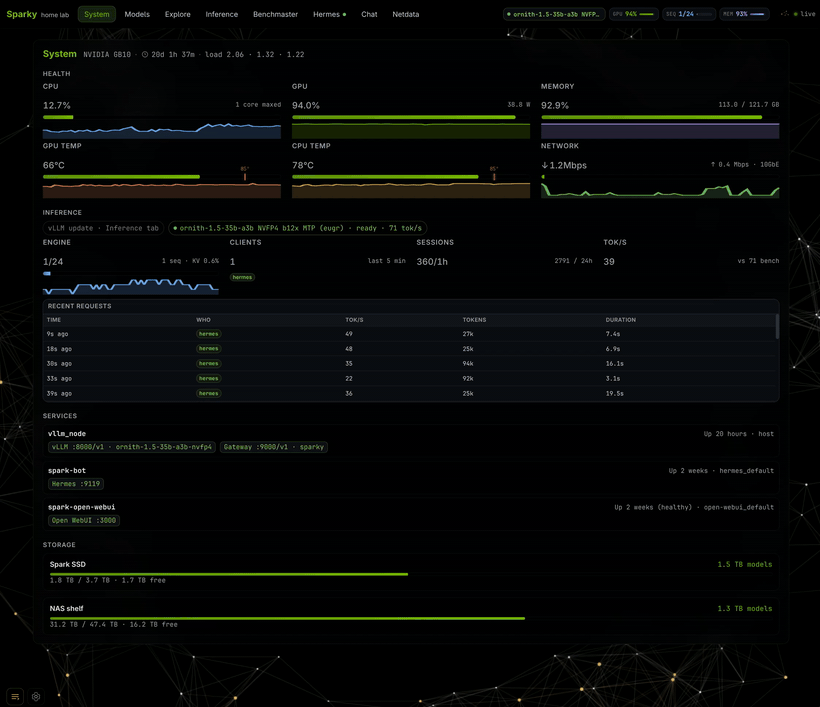
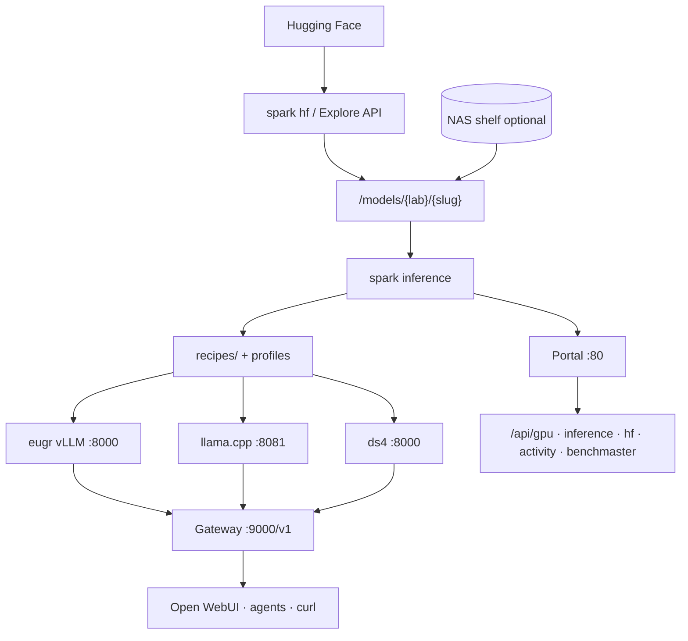

<div align="center">

# SparkBench

**Open-source model lab for the NVIDIA DGX Spark (GB10).**

Discover models · Benchmark them · Switch profiles · Serve them.
One CLI, one box, no cloud.

[Live leaderboard](https://sparkbench.dev) · [Docs](#documentation) · [Contributing](CONTRIBUTING.md)

[](LICENSE)
[](CONTRIBUTING.md)

</div>

<p align="center">
  
</p>

<p align="center"><sub>Portal: switch profiles, browse models, explore Hugging Face. <a href="docs/assets/RECORDING.md">Record CLI / install demos</a></sub></p>

---

## What it is

SparkBench is a self-hosted dashboard and inference control plane for a single DGX Spark. One CLI covers the loop from Hugging Face to a serving profile:

- **Portal**: System, Models, Explore, Inference, and Benchmaster
- **Three engines**: vLLM (eugr), llama.cpp, ds4 (DeepSeek V4 Flash). One GPU at a time.
- **Model Lab**: Auto-scaffold recipes from weights, mark testing, bench, promote
- **Benchmarks**: Bench v2 (verify gate), PBM 4k/50k/100k ladder (site display)
- **Hugging Face**: Search, queue, download, dedupe into `/models`
- **NAS shelf** (optional): Mirror weights to a CIFS share. Local `/models` works alone.
- **Gateway**: OpenAI-compatible `:9000/v1` for OpenCode, Grok, Hermes, Open WebUI

Numbers measured here feed **[sparkbench.dev](https://sparkbench.dev)**. Speed is GB10 tok/s. SWE and Terminal-Bench on that site are vendor citations, not Spark runs.

## Why

DGX Spark is strong hardware with no opinionated loop. SparkBench is that loop: see a model on Hugging Face, download it, scaffold a recipe, bench it, serve it.

If you own a Spark, run this. If you are shopping for one, the [leaderboard](https://sparkbench.dev) shows what a GB10 actually does.

## Why not just vLLM or llama.cpp?

Raw engines are fine. SparkBench wraps them for one box and one loop:

| You want… | Raw vLLM / llama.cpp | SparkBench |
|-----------|----------------------|------------|
| Run one model | Write compose YAML, pick ports, remember flags | `spark inference up <profile>` |
| Switch models | Stop container, edit config, restart | Same CLI. Recipes hold the flags. |
| Compare tok/s fairly | Roll your own scripts | `spark inference bench` (v2) and PBM fills |
| Try a new HF model | Download + hand-write serve config | Explore queue → scaffold → bench → promote |
| Share results | Paste numbers in a gist | Verification YAML → [sparkbench.dev](https://sparkbench.dev) |
| Agent / UI access | Wire an OpenAI URL yourself | Gateway `:9000/v1` + portal + HTTP APIs |

SparkBench uses eugr vLLM, llama.cpp, and ds4. It does not replace them. It adds the control plane, inventory, and benchmark layer.

## Quickstart

### For LLM agents

Fetch the guide and follow it in order:

```bash
curl -fsSL https://raw.githubusercontent.com/shawnmarck/sparkbench/v0.1.0/docs/guides/installation-instructions.md
```

### For humans

One command clones to `/opt/spark` and installs portal, APIs, and CLI (no GPU engine yet):

```bash
curl -fsSL https://raw.githubusercontent.com/shawnmarck/sparkbench/main/scripts/bootstrap-sparkbench.sh | sudo bash
```

Then pick an engine and the gateway:

```bash
sudo bash install/spark-install engine eugr   # or llama | ds4
sudo bash install/spark-install gateway
bash scripts/sparky-protect-runtime.sh
spark models inventory
```

<details>
<summary>Manual install (same steps, no curl bootstrap)</summary>

```bash
git clone https://github.com/shawnmarck/sparkbench.git /opt/spark
cd /opt/spark
export SPARK_HOST=mybox SPARK_LAN_IP=192.168.1.50 SPARK_USER="$USER"
sudo bash install/spark-install quickstart    # bootstrap + core
sudo bash install/spark-install engine eugr
sudo bash install/spark-install gateway
```

</details>

Open **http://&lt;host&gt;/**. Module index: [install/INSTALL.md](install/INSTALL.md).

### CLI in action

After `engine` + `gateway` (record a GIF: [docs/assets/RECORDING.md](docs/assets/RECORDING.md)):

```text
$ spark inference list
  opencode-qwen36-250k   eugr     heavy   enabled
  qwen36-q4-llama        llamacpp heavy   enabled

$ spark inference up opencode-qwen36-250k
  switching… (evicts the current engine; NVFP4 can take minutes)

$ spark inference status
  profile: opencode-qwen36-250k   engine: eugr   ready: true

$ spark inference bench
  bench v2 … decode tok/s   written to run/

$ curl -s http://sparky:9000/v1/models | head
  … sparky alias + active served name …
```

Four commands: list → up → bench → talk to `:9000`.

## Use it

One CLI on PATH: `spark`. Humans and agents use the same command.

```bash
spark status                          # GPU + inference in one glance
spark inference list                  # enabled profiles
spark inference up opencode-qwen36-250k
spark inference bench                 # bench v2 on the active profile
spark inference logs

spark recipe list                     # draft / testing / production
spark models inventory                # rebuild portal/models.json
spark models verify set <lab/slug> works   # only after bench v2

spark hf search "qwen3.6"
spark hf queue add <repo>
spark shelf push <lab/slug>           # when a NAS shelf is mounted

spark benchmaster status              # overnight perf / intel queue
```

Full reference: [docs/reference/spark-cli.md](docs/reference/spark-cli.md).

HTTP:

```bash
curl http://sparky/api/inference/status
curl http://sparky/api/gpu
curl http://sparky/api/shelf/status
curl http://sparky/api/benchmaster/status
```

OpenAI-compatible gateway: `http://sparky:9000/v1`. Prefer model `sparky` (or `sparky-think`) so clients follow whatever is active.

## The Model Lab loop

```
  Explore  →  Download  →  Draft recipe  →  Test  →  Bench  →  Promote
 (HF)        (queue)      (auto-scaffold)           (v2/PBM)   (production)
```

| Step     | Portal            | Backend                                |
|----------|-------------------|----------------------------------------|
| Discover | Explore           | `/api/hf/*`, explore queue             |
| Acquire  | Download queue    | `spark hf`, `/models/{lab}/`           |
| Define   | Models → scaffold | `scaffold_auto`, `recipes/drafts/`     |
| Validate | Inference         | `spark inference`, bench v2 / PBM      |
| Promote  | Models → promote  | `recipes/` + `inference-profiles.yaml` |
| Operate  | System            | Gateway `:9000`, activity widget       |
| Sweep    | Benchmaster       | perf_sweep, ctx ladder, intel eval     |

Recipes are auto-scaffolded from weights and Hugging Face metadata. Hand-write YAML only when the router cannot (MoE, multimodal, DFlash, ds4, MTP).

## Engines

| Engine        | What it serves            | When to use                          |
|---------------|---------------------------|--------------------------------------|
| **eugr**      | vLLM (NVFP4, FP8)         | High-throughput dense + MoE, long ctx |
| **llama.cpp** | GGUF (Q4, Q5, MTP)        | Lower memory, fast switch            |
| **ds4**       | DeepSeek V4 Flash         | Native sparse-attention path         |

One GPU at a time. `spark inference up <profile>` evicts the current engine. Golden map: [`data/golden-recipes.yaml`](data/golden-recipes.yaml). `qwen36-nvfp4` is deprecated; everyday Qwen3.6-35B-A3B is `opencode-qwen36-250k`.

## Architecture


```mermaid
flowchart TB
  HF[Hugging Face] --> hf[spark hf / Explore API]
  hf --> models["/models/{lab}/{slug}"]
  NAS[(NAS shelf optional)] --> models
  models --> inf[spark inference]
  inf --> recipes[recipes/ + profiles]
  recipes --> eugr[eugr vLLM :8000]
  recipes --> llama[llama.cpp :8081]
  recipes --> ds4[ds4 :8000]
  eugr --> gw[Gateway :9000/v1]
  llama --> gw
  ds4 --> gw
  gw --> clients[Open WebUI · agents · curl]
  inf --> portal[Portal :80]
  portal --> apis["/api/gpu · inference · hf · activity · benchmaster"]
```

One GPU engine at a time. Static portal on nginx :80. Mutation APIs are LAN-trusted. Do not expose port 80 to the WAN.

<details>
<summary>ASCII version</summary>

```
Hugging Face → spark hf → /models/ ← NAS (optional)
                ↓
         spark inference (recipes)
                ↓
    eugr :8000 · llama :8081 · ds4 :8000
                ↓
         Gateway :9000/v1 → agents / Open WebUI
```

</details>

## Documentation

| Path | Topic |
|------|--------|
| [CHANGELOG.md](CHANGELOG.md) | Release history |
| [AGENTS.md](AGENTS.md) | Agent manual: layout, rules, code touchpoints |
| [docs/guides/installation-instructions.md](docs/guides/installation-instructions.md) | Install + ops (agents fetch this) |
| [docs/guides/first-spark-setup.md](docs/guides/first-spark-setup.md) | Clone → inventory → first profile |
| [docs/reference/spark-cli.md](docs/reference/spark-cli.md) | Full `spark` CLI |
| [docs/reference/inference-stack.md](docs/reference/inference-stack.md) | Control plane, recipes, gateway |
| [docs/reference/benchmark-standard.md](docs/reference/benchmark-standard.md) | Bench v2 and PBM |
| [docs/reference/published-evals.md](docs/reference/published-evals.md) | Vendor SWE / TB on sparkbench.dev |
| [docs/reference/ui-improvements.md](docs/reference/ui-improvements.md) | Portal tabs and pages |
| [docs/guides/model-shelf.md](docs/guides/model-shelf.md) | `/models` + NAS shelf |
| [docs/guides/model-picks.md](docs/guides/model-picks.md) | How the catalog is chosen |
| [docs/guides/local-model-testing.md](docs/guides/local-model-testing.md) | Bench a model; Benchmaster queue |
| [docs/runbooks/smoke-vllm-eugr.md](docs/runbooks/smoke-vllm-eugr.md) | vLLM smoke |
| [docs/runbooks/smoke-llamacpp.md](docs/runbooks/smoke-llamacpp.md) | llama.cpp smoke |
| [docs/runbooks/smoke-ds4.md](docs/runbooks/smoke-ds4.md) | ds4 smoke |
| [docs/runbooks/new-model-golden-benchmark.md](docs/runbooks/new-model-golden-benchmark.md) | Golden audit for a new model |
| [docs/runbooks/benchmaster-agent.md](docs/runbooks/benchmaster-agent.md) | Supervise the overnight queue |
| [docs/runbooks/sparky-live-sync.md](docs/runbooks/sparky-live-sync.md) | Pull code on a live box |
| [install/INSTALL.md](install/INSTALL.md) | Install targets + modules |
| [docs/assets/RECORDING.md](docs/assets/RECORDING.md) | How to capture CLI / install demos |

## Contributing

PRs welcome. See [CONTRIBUTING.md](CONTRIBUTING.md): one PR per task, smoke after merge.

Two useful contributions:

1. **Bench a new model** on your Spark and open a PR with the recipe + verification YAML. It lands on [sparkbench.dev](https://sparkbench.dev) after the site rebuild.
2. **Fix a sharp edge**: runbooks, install scripts, portal UX. Small PRs.

## License

[MIT](LICENSE). Not affiliated with or endorsed by NVIDIA Corporation.
